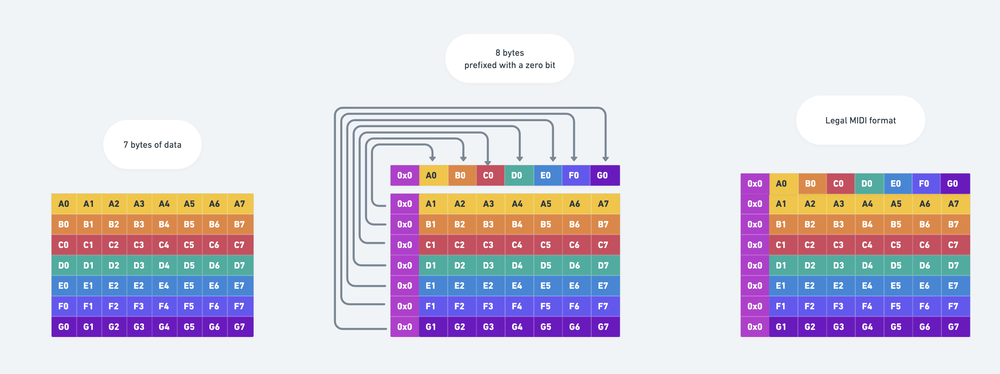

# Monologue Librarian

## setup
```
cd MonologueLibrarian
yarn
npx ts-node src/index.ts
```
Then dump patch from Monologue

##  Sysex data format
Sysex data is sent in frames of 8 bytes. Each byte has a leading zero. Each leading zero is discarded. The first byte in the frame is transposed and each bit replaces the leading zero bit in the bytes of the frame. See this diagram for details.
